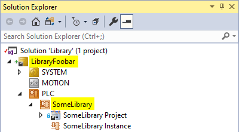

# TcBuild
CLI tool for building Beckhoff TwinCAT solutions

## Requirements

[.NET Framework 4.8](https://dotnet.microsoft.com/en-us/download/dotnet-framework/net48) or higher

## Examples

### Building a solution 
Feedback from the compiler is shown. The prefix (`I`nfo, `W`arning, `E`rror) shows the build error level.

    D:\>TcBuild build SomeSolution.sln
    I: generate global initializations ...
    I: typify code ...
    I: Generate TMC information ...
    I: Import symbol information ...
    I: generate code initialization ...
    I: Size of global data: 12245 bytes
    I: Memory area 0 contains  Data, Input, Output, Memory, Code, Persistent Data and Nonsafe Data: size: 1048576 bytes, highest used address: 449584, largest contiguous memory gap: 598992 bytes (57 %)
    I: generate code...
    I: generate relocations ...
    I: Size of generated code: 52912 bytes
    I: ------ Build started: Application: SomeSolution.PLC -------
    I: Build complete -- 0 errors, 0 warnings : ready for download!
    I: Total allocated memory size for code and data: 449584 bytes
    I: PLC.SomeLibrary:0 - generate boot information...

### Installing a library

Installs a library into the Library Repository (usually located at `D:\TwinCAT\3.1\Components\Plc\Managed Libraries`), and saves the library as a `.library` file.

    D:\>TcBuild install Library.sln -x LibraryFoobar -p SomeLibrary
    I: generate global initializations ...
    I: typify code ...
    etc...

Note the 2 additional arguments `LibraryFoobar` and `SomeLibrary`. These point to the names of the TwinCAT XAE project and the PLC project containing the library:\

## Help

Use the help function for more information on the available commands and options:

    D:\> TcBuild --help
    Description:
    CLI tool for building Beckhoff TwinCAT solutions

    Usage:
    TcBuild [command] [options]

    Options:
    --version       Show version information
    -?, -h, --help  Show help and usage information

    Commands:
    build <file>    Build the solution.
    install <file>  Save and install a PLC project in the solution as a library.

This also works for the miscellaneous commands:

    D:\>TcBuild install --help
    Description:
    Save and install a PLC project in the solution as a library.

    Usage:
    TcBuild install [<file>] [options]

    Arguments:
    <file>  The TwinCAT solution file (.sln)

    Options:
    -x, --xaeproject <xaeproject> (REQUIRED)    The XAE project containing the PLC project.
    -p, --plcproject <plcproject> (REQUIRED)    The PLC project to be used as a library.
    -l, --libraryfile <libraryfile>             The filename of the resulting .library file. Overwrites existing file.
                                                If left empty, the PLC project name is used.
    -?, -h, --help                              Show help and usage information

## Exit codes

The application exit code (`echo %errorlevel%`) provides more information on the build result.

| Code | Description |
| --- | --- |
| 0 | Successful build |
| 1 | Successful build, but with compile warnings |
| 2 | Build failed due to compile errors |
| 3 | Build failed due to an unhandled COM exception |
| 4 | Build failed due to an unknown exception |
